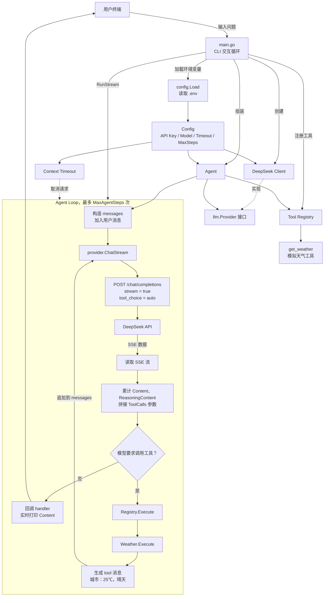
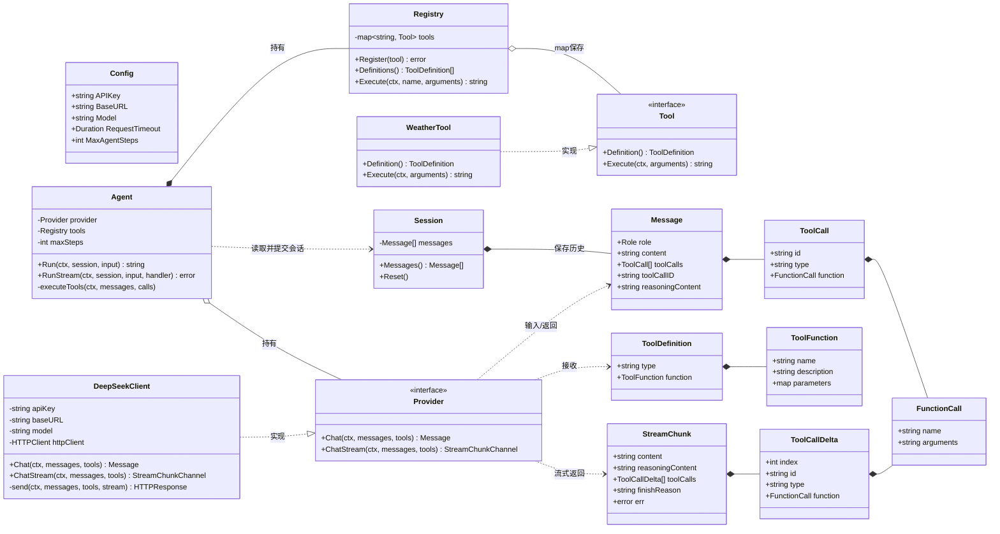

# Go Streaming Agent

一个使用 Go 标准库实现的流式 AI Agent 示例，包含 DeepSeek SSE、工具调用和可取消的 Agent Loop。

## 运行

1. 复制 `.env.example` 为 `.env`，或直接设置对应环境变量。
2. 设置 `DEEPSEEK_API_KEY`。
3. 执行：

```bash
go run ./cmd/agent-cli
```

输入 `exit` 退出。

## 运行架构



天气工具当前不访问真实天气服务，而是固定返回“城市：25℃，晴天”。

## 核心结构体关系



核心组合关系：

```text
Agent
├── Provider 接口
│   └── DeepSeek Client 实现
├── Registry
│   └── map[string]Tool
│       └── Weather Tool 实现
└── maxSteps

Session
└── []Message 会话历史
```

`Agent` 不直接依赖 DeepSeek 和 Weather 的具体实现，而是分别依赖 `Provider`、`Tool` 接口，因此可以替换模型实现或继续注册其他工具。`Session` 独立保存一段对话的历史，使同一个 Agent 可以安全地服务不同会话。

## 测试

```bash
go test ./...
go vet ./...
```
